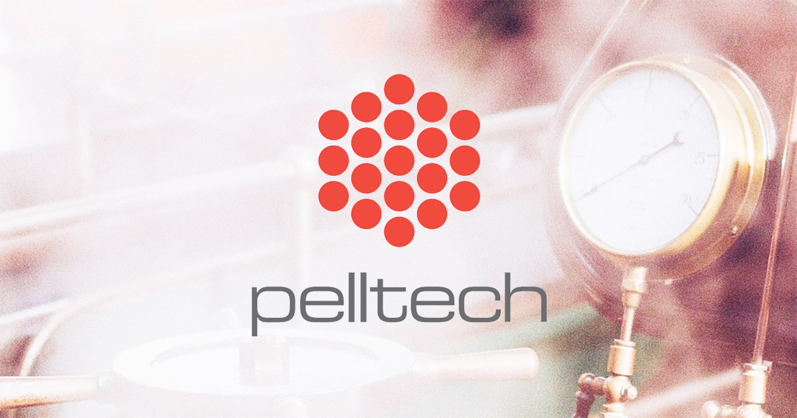

# Pelltech Promo — промо-лендинг (портфолио 2020)

Статический промо-сайт для индустриальных пеллетных котлов. Проект сделан мной как пример того, как я собираю аккуратные, быстрые и удобные лендинги без лишних зависимостей: чистая вёрстка, понятная структура, интерактивные элементы и продуманный пользовательский сценарий.

## Что демонстрирует проект

- **Упаковка продукта**: визуальные блоки, преимущества, доверие, CTA-цепочка
- **Адаптивность**: корректная работа на мобильных/планшетах/десктопе
- **Интерактив**: 360° просмотр, галерея/lightbox, слайдер контента
- **Чистая архитектура**: модульные CSS-блоки, легко расширять и поддерживать
- **Готовность к продакшену**: CI-проверки и автоматический деплой на GitHub Pages

## Функциональность

- 360° viewer продукта
- Галерея изображений + lightbox
- Responsive slider
- Адаптивная навигация и CTA-переходы

## Стек

- HTML5
- CSS3 (блочная/модульная структура)
- Vanilla JavaScript
- GitHub Actions (CI + GitHub Pages deploy)
